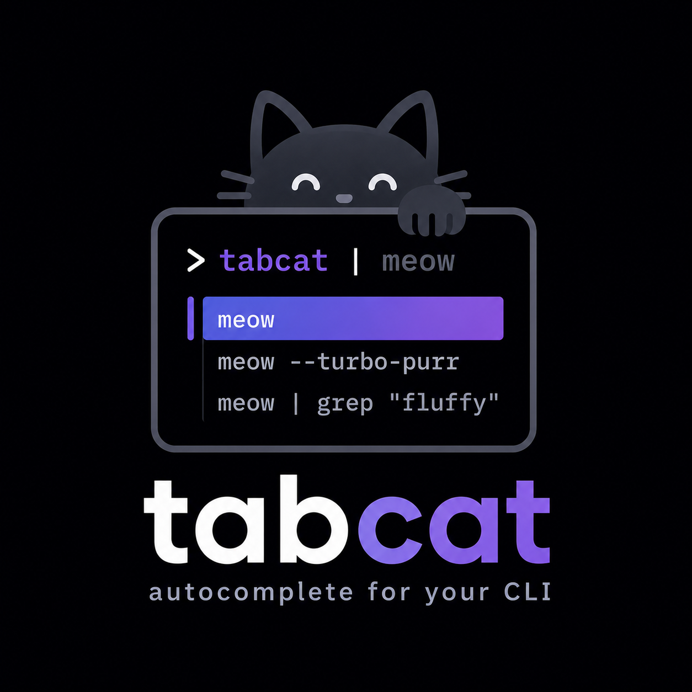

<p align="center">
  
</p>

<h1 align="center">tabcat</h1>

<p align="center">
  <strong>Chunk-based shell autocomplete that learns from <em>your</em> commands.</strong><br>
  Tab, tab, tab through the stable parts of a command — type only the part that changes.
</p>

<p align="center">
  
  
  
  
</p>

---

## Why tabcat?

Most shell completion tools are **opportunistic**: they guess at whole commands from a giant, anonymous history and throw suggestions at you that you accept maybe once in a while. Autosuggestion plugins replay your *entire last matching line*; static completion specs only know flags, not *your* workflow.

tabcat is different by design: it helps you with the commands **you already run, over and over**. It breaks every command you execute into small chunks, learns which chunks are stable and which vary, and then lets you Tab through the stable scaffolding of a command — stopping exactly at the points where *you* usually make a decision.

- **Chunk-based, not line-based.** `git checkout feature/` and `git checkout bugfix/` share a stable prefix. tabcat completes `git checkout ` as one unit and *stops* — because that's where your commands diverge. Type the variable part yourself, then Tab again.
- **It learns from every use.** A frecency model (frequency × recency) with a strong short-term memory means what you worked on *this morning* outranks what you ran three weeks ago. It even knows *where*: commands learned in the current directory get a boost.
- **It never overshoots.** A variability-aware merge looks ahead along the prediction and stops Tab at the first real fork — you never accept five chunks of wrong suggestion you have to delete.
- **It's yours alone.** Everything is learned locally from your own history, stored in a local append-only file. No network, no telemetry leaves your machine, no model trained on other people's commands.

```text
$ git ch█                     ← you type two chunks
  git checkout develop        ← tabcat offers ranked candidates
$ git checkout ▊              ← Tab accepts the stable part, stops at the fork
$ git checkout feature/42-fix▊ ← you type the variable part — Tab again
```

## How it works

tabcat's engine is a pure, terminal-independent TypeScript library:

1. **Lexer** — every command line is split into small typed chunks (words, flags, separators, quotes, operators, spaces). Reconstruction is lossless: `join(lex(line)) === line`.
2. **Chunk model** — variable-length n-grams over chunk sequences (with `BEGIN`/`END` sentinels) record every occurrence with timestamp and working directory.
3. **Frecency scoring** — each occurrence scores as long-term decay (7-day half-life, with a floor so old favorites stay findable) plus a heavily weighted short-term decay (4-hour half-life: "today I'm working on X"), multiplied by a boost for commands learned in the current directory.
4. **Variability-aware merge** — when you hit Tab, tabcat looks ahead from the top candidate and merges following chunks only while the branching factor is ≈ 1 (the top continuation carries ≥ 90 % of the probability mass). At the first genuine fork — or where your lines usually end — the merge stops. That's the anti-overshoot rule.
5. **Prediction** — history candidates are ranked structurally (longest matching context wins; shorter back-off contexts only fill gaps), then enriched with live filesystem completion: case-insensitive, quote- and escape-aware (`doc` + Tab → `Documents`), and deliberately suppressed right after flag values so `-m` doesn't flood you with paths.

Typos don't poison the model: commands that exited with 126/127 (command not found / not executable) are never learned.

## The REPL

tabcat ships an Ink-based smart prompt with ghost text and a scrolling dropdown:

| Key | Action |
|---|---|
| `Tab` | Accept the selected candidate (fully merged); cycles when nothing new to insert |
| `→` | Accept one chunk at a time |
| `Shift+Tab` | Undo the last accept |
| `↑` / `↓` | Empty line: history (substring-filtered once you typed); otherwise: move in the dropdown |
| `Ctrl+R` | Fuzzy history search |
| `Ctrl+N` | Name this command (magic name) |
| `Ctrl+X` | Forget the shown magic name |
| `Ctrl+Backspace` | Delete one chunk · `Alt+Backspace` deletes fast |
| `Ctrl+A/E/U/W/K/L` | Familiar readline shortcuts |
| `Esc` | Close the dropdown |
| `Ctrl+D` | Exit |

Half-typed lines are stashed when you browse history and restored when you come back — like zsh.

**Multiline pastes** bypass completion entirely: the block appears verbatim below the prompt, `Enter` runs it exactly as pasted (backslash continuations, quoting, and one-command-per-line stay intact), `Esc` discards it. Nothing auto-runs — unlike a plain terminal, a pasted trailing newline never submits. Single-line pastes keep the normal inline behavior.

Each command runs in an **isolated shell**. The working directory persists between commands (including `cd x && make`); exported variables, shell functions, options and aliases defined *during* the session apply only to that one command. Aliases from your shell's startup config are imported once at launch.

## Magic names

Long, hard-to-read commands get a short handle you assign yourself — no AI, no config file, just `Ctrl+N` on a typed command:

```text
~/proj ❯ docker compose -f qlico/compose.yaml run php vendor/bin/phpstan analyze src
 ⚡ phpstananalyze▏   a-z 0-9 · enter: save+run · esc: cancel
```

- **Create:** type the command, press `Ctrl+N`, type a handle (3–16 chars, `a-z 0-9`), Enter saves it *and* runs the command. Esc cancels without executing. Enter never blocks: an invalid or colliding handle just runs the command without saving.
- **Use:** type the handle as the first word — it appears as the top suggestion with its resolution; `Tab` expands it (append args as usual). Typing the *exact* handle and pressing Enter runs the resolved command in one step. History always records the full command, never the handle.
- **Discover:** when you type (or complete to) a command that already has a handle here, a ` ⚡ handle ` badge shows it — that's how you learn your own shortcuts.
- **Scope:** a handle is bound to the directory it was created in and never surfaces elsewhere (relative paths stay safe).
- **Edit/delete:** `Ctrl+N` on a named command prefills the handle; clear it and press Enter to delete. Or press `Ctrl+X` whenever a magic name is in your way — on a selected ⚡ suggestion or the ⚡ badge — to forget it on the spot, without running anything.
- `:names` lists your handles in the REPL, `tabcat names` on the CLI. Set `TABCAT_MAGIC_NAMES=0` to turn the feature off.

## Getting started

**Requirements:** Node.js ≥ 20, and zsh or bash.

```bash
npm install -g tabcat   # or run without installing: npx tabcat

tabcat import           # seed the model from your zsh/bash history
tabcat                  # start the smart prompt
```

<details>
<summary>From source</summary>

```bash
git clone https://github.com/d3vpunk/tabcat.git tabcat
cd tabcat
npm install             # prepare script builds dist automatically
npm link                # puts the CLI on your PATH
```

</details>

Run `tabcat import` once — tabcat parses your existing `~/.zsh_history` or `~/.bash_history` (shell auto-detected via `$SHELL`) and starts with useful suggestions from day one. Re-imports are idempotent.

### Autostart (optional)

To drop into tabcat in every new terminal, add this to the end of your `~/.zshrc` or `~/.bashrc`:

```sh
# start tabcat automatically in interactive terminals
if [[ $- == *i* ]] && [[ -z "$TABCAT_AUTOSTART" ]] && command -v tabcat >/dev/null; then
  export TABCAT_AUTOSTART=1
  command tabcat repl
fi
```

The guard variable keeps nested shells (and the commands tabcat itself runs) from re-entering the REPL. Quitting tabcat (`Ctrl+D` or `:exit`) lands you in your regular shell.

> Using a lazy-loaded version manager (nvm & co.)? Make sure the Node bin directory is on `PATH` before this block runs — e.g. `export PATH="$NVM_DIR/versions/node/<your-version>/bin:$PATH"` — otherwise `command -v tabcat` comes up empty at startup.

## zsh plugin (variant 2)

Instead of a separate prompt, tabcat can also run **inside your own zsh** — ghost
text, Tab accept and learning in the shell you already use. Both variants share
`history.jsonl` and `names.jsonl`, so you can switch back and forth and each
learns from the other.

```bash
tabcat plugin init zsh              # prints the line for your .zshrc
tabcat plugin init zsh --check      # preflight: node, zsh, modules, socket path
```

Add the printed line to `~/.zshrc` (position does not matter — the learning hook
puts itself first on its own):

```sh
source /path/to/tabcat/dist/tabcat.plugin.zsh
```

**Keys.** Every plain Ctrl key is taken by zsh itself, so tabcat uses the `^X`
family and leaves your muscle memory alone — `^N`, `^R` and the whole `^X`
prefix keep working:

| Key | Action |
|---|---|
| `Tab` | Accept the top candidate. No candidates → your previous Tab binding (compsys, fzf-tab) handles the key |
| `→` | Accept one chunk (only at the end of the line) |
| `Shift+Tab` | Undo the last accept |
| `Enter` | Expand an exact magic-name handle, then run it |
| `^Xl` | **L**abel: name the current command (magic name) |
| `^Xf` | **F**orget the name of the current command |
| `^Xq` | **Q**uery: fuzzy history search |
| `^Xd` | Candidate menu (`compadd` + `menu-select`) |

**Configuration** (set before the `source` line):

| Variable | Default | Effect |
|---|---|---|
| `TABCAT_GHOST` | `1` | Ghost text on/off |
| `TABCAT_BADGE` | `1` | ⚡ handle badge on/off |
| `TABCAT_GHOST_STYLE` | `fg=8` | Highlight of the ghost text |
| `TABCAT_KEY_LABEL` / `_FORGET` / `_QUERY` / `_MENU` | `^Xl` / `^Xf` / `^Xq` / `^Xd` | Rebind the chords |
| `TABCAT_TIMEOUT` | `0.05` | Seconds the shell waits for the daemon before falling back |
| `TABCAT_NO_LEARN` | unset | Set to `1` to stop learning in this shell |
| `TABCAT_SOCKET` | derived | Socket path (mirrors `tabcat daemon --socket`) |
| `TABCAT_WARM_ON_LOAD` | `1` | Start the daemon when the shell starts (~14 ms, fire and forget) instead of on the first keystroke |
| `TABCAT_FORCE` | unset | Load despite detected conflicts, take bound chords over |

**What tabcat stores, and what it does not.** The plugin learns every command
you run — except the ones your shell already keeps out of its history:

- commands with a leading space when `hist_ignore_space` is set (the standard
  way to hide a secret)
- anything matching your `HISTORY_IGNORE` pattern
- `history` / `fc` when `hist_no_store` is set
- everything, in a shell with `TABCAT_NO_LEARN=1`

Learned lines live in `~/.config/tabcat/history.jsonl` (mode 0600), handles in
`names.jsonl` next to it. Delete either file to forget.

### How the plugin talks to the engine

A background daemon holds the model; the plugin keeps one unix socket open per
shell and asks it per keystroke.

```bash
tabcat daemon          # run in the foreground (the plugin starts it on demand)
tabcat daemon status   # version, protocol, state, pid
tabcat daemon stop
```

Measured on macOS/zsh 5.9: **0.027 ms** per request over the persistent fd,
versus ~6 ms for a `nc -U` fork per keystroke and ~110 ms for a Node cold start
— which is why it is a daemon and why the shell holds the fd open. A cold daemon
needs ~0.3 s until it listens, so the plugin starts it **at shell startup**,
fire and forget (~14 ms of your prompt), rather than making your first keystroke
wait for it. Later shells find the socket and do nothing.

The daemon compacts the history, exits after 45 minutes idle, and answers
`warming` while it is still building the model so an early Tab falls back
instead of blocking.

If the daemon is missing, slow or speaks another protocol version, the widgets
fall back to plain zsh behaviour. The shell never hangs on tabcat.

> bash is not supported as a plugin, and probably never will be — the REPL is
> the answer there.

## CLI

| Command | Description |
|---|---|
| `tabcat` / `tabcat repl` | Start the smart prompt |
| `tabcat --minimal` | Compact prompt for short terminals (IDE panes): one suggestion row with inline counter, no legend line — search, paste mode and naming behave as usual |
| `tabcat import [--file <path>]` | Seed the model from shell history |
| `tabcat simulate --line 'git ch' [--cwd <dir>] [--now <ms>] [--json]` | Show the ranking and what Tab would insert — explore and calibrate the algorithm without the UI. `--json` for scripts and bug reports |
| `tabcat stats` | History overview (entries, directories) |
| `tabcat names` | List magic names (`Ctrl+N` in the REPL, `^Xl` in the plugin) |
| `tabcat plugin init zsh [--check]` | Print the `.zshrc` snippet for the zsh plugin, or run the preflight check |
| `tabcat daemon [status\|stop]` | Prediction daemon for the zsh plugin |
| `tabcat --history <path>` | Use an alternative history file (default: `~/.config/tabcat/history.jsonl`) |
| `tabcat daemon --socket <path>` | Use an alternative daemon socket (default: `$XDG_RUNTIME_DIR/tabcat/daemon.sock`, fallback `/tmp/tabcat-<uid>/daemon.sock`) |

## Tuning the algorithm

The defaults in `DEFAULT_SCORING` / `DEFAULT_MERGE` / `DEFAULT_PREDICTOR`:

| Parameter | Default | Effect |
|---|---|---|
| `halfLifeDays` | 7 | Long-term decay of frequency |
| `shortHalfLifeHours` | 4 | Short-term decay ("today I'm working on X") |
| `shortWeight` | 8 | Weight of the short-term term |
| `cwdBoost` | 3 | Multiplier for commands learned in the current directory |
| `backoffPenalty` | 0.3 | Score discount per back-off level (shorter context) |
| `merge.threshold` | 0.9 | Probability mass the top next chunk must carry to keep merging |
| `topN` | 50 | Ranked candidate pool (the dropdown shows 5, scrolling) |
| `staleThreshold` | 0.25 | Below this a candidate counts as stale and ranks behind fresh back-off when no prefix is typed |

The learned history is capped at 20,000 entries; beyond that the append-only file is compacted atomically to the most recent entries (startup-time and memory protection).

## Project layout

```text
src/
  engine/            # pure TypeScript library — no terminal dependencies
    lexer.ts         # line → chunks (lossless)
    model.ts         # n-gram chunk model, frecency scoring, back-off
    merge.ts         # variability-aware merge (Tab stops at forks)
    predictor.ts     # facade: (line, cursor, cwd) → ranked candidates
    fs-completer.ts  # path completion (injectable FS)
    shell.ts         # zsh/bash adapters: alias snapshot, exec, history import
    store.ts         # append-only JSONL history, locking, compaction
    names.ts         # magic names: handle validation + in-memory index
    names-store.ts   # append-only names.jsonl with tombstone deletes
  daemon/            # headless engine host for the zsh plugin
    protocol.ts      # TSV wire format (zsh has no JSON parser)
    engine-host.ts   # predictor + names, byte-offset tail follow, compaction
    server.ts        # unix socket, warm-up, idle exit, connection caps
    client.ts        # one-shot client for `daemon status|stop`
    paths.ts         # socket location (sun_path limit, ownership checks)
  plugin/
    tabcat.plugin.zsh  # widgets, ghost text, learning hook, key bindings
    init.ts          # `plugin init zsh` snippet + preflight check
  repl/              # Ink UI
    app.tsx          # rendering: prompt, dropdown, ghost text
    prompt-state.ts  # all UX logic as a pure, testable state machine
    executor.ts      # isolated shell execution with cwd persistence
    run.ts           # loop: prompt → execute → learn → prompt
  cli.ts             # repl / import / simulate / stats / names / daemon / plugin
```

## Development

```bash
npm install
npm test                                   # engine, daemon, plugin and pty tests
npx tsx src/cli.ts simulate --line 'git ch'
npx tsx src/cli.ts repl
```

The engine is fully decoupled from the terminal — the lexer, model, merge and prediction are tested against scenario suites (context back-off, cwd boost, time shift, filesystem merge) without any TTY.

The plugin is covered on three levels: the TSV wire format and the socket path are pinned to their TypeScript counterparts by cross-language parity tests, the shell functions (privacy filter, buffer surgery, key wiring, hook order) run in a pristine `zsh -f`, and a small `zpty` set drives the real widgets in a real pseudo terminal. zsh is required for those; without it they skip.

## Status

tabcat is young and evolving. The engine is feature-complete; the REPL is built and being polished. Feedback and contributions welcome.
